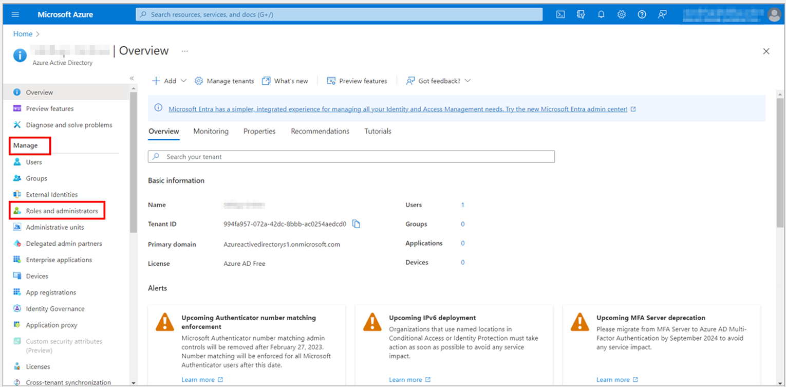
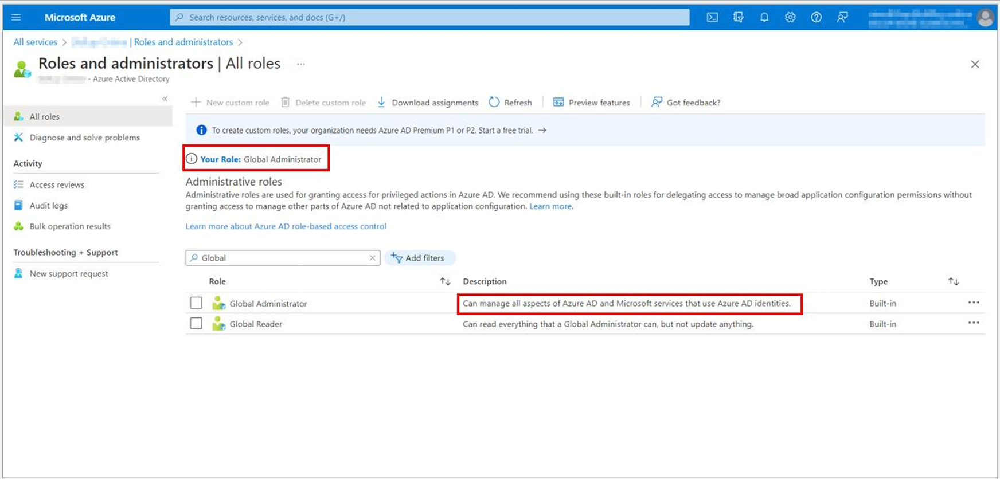
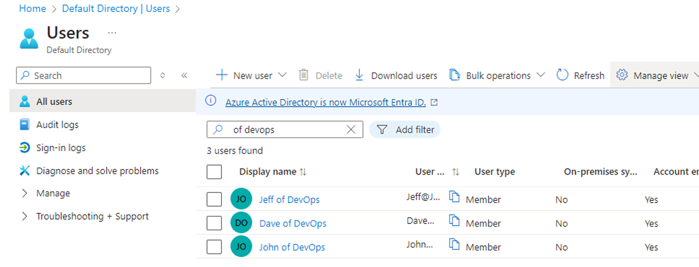
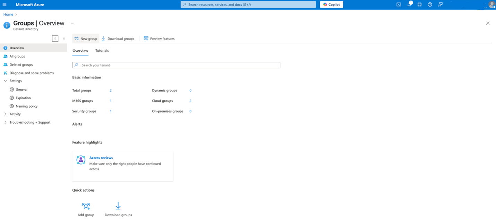
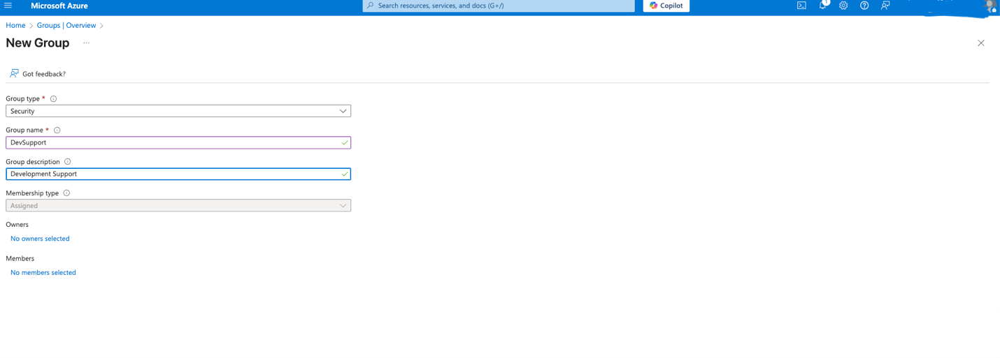
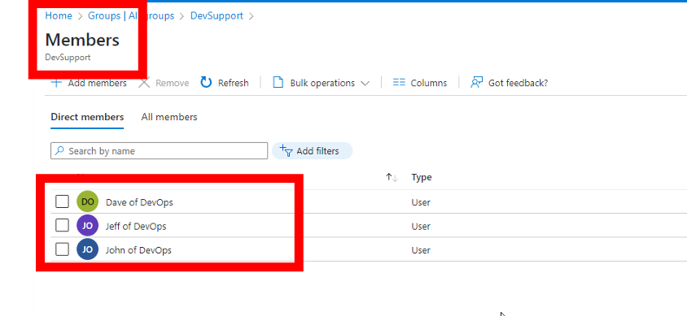

# Secure Access with Azure Active Directory

This project was completed as part of the **Secure Access with Azure Active Directory** course on Coursera. It simulates real-world tasks performed by Azure Security Engineers, focusing on identity management, user access configuration, and securing accounts using Azure Active Directory (Azure AD).

---

## Tasks Performed

As part of the final project, the following tasks were completed in a live Azure environment:

- **Task 1:** Add new users in Azure AD  
- **Task 2:** Create a group and add members  
- **Task 3:** Enable self-service password reset (SSPR) for a group  
- **Task 4:** Test password reset flow as a standard user  
- **Task 5:** Enable and configure multi-factor authentication (MFA) for a user  

---

## What Was Done

### Task 1: Add a New User

1.	Sign in to the [Azure portal](https://portal.azure.com) with your login credentials. Navigate to **Azure Active Directory**. Select **Roles and administrators** under the **Manage** blade.

2.	To create a user, check your role. If your role is listed as **Global Administrator**, you can manage all aspects of Azure AD:
   - As Global Admin

   - New User (John, Dave, Jeff)

---

### Task 2: Create Group and Add Members

1. Navigated to **Azure Active Directory → Groups → + New group**.

2. Filled group details:
   - Group type: Security  
   - Name: DevSupport  
   - Description: Development Support
3. Chose **Assigned** membership type and created group.  

4. Opened the group → **Members → + Add members**.  

---

### Task 3: Enable Self-Service Password Reset (SSPR)

1. Navigated to **Azure Active Directory → Password Reset → Properties**.  
2. Chose **Selected** under “Self-service password reset enabled”.  
3. Selected the group **DevSupport** for SSPR.  
4. Clicked **Save** to apply changes.
---

### Task 4: Test SSPR as Standard User

1. Opened browser in **incognito mode**, went to:  
   [https://passwordreset.microsoftonline.com](https://passwordreset.microsoftonline.com)  
2. Entered user email, verified identity (via email/SMS).  
3. Reset the password successfully.  
4. Logged in using new password at [https://portal.office.com](https://portal.office.com).
---

### Task 5: Enable and Configure Multi-Factor Authentication (MFA)

1. Navigated to **Azure Active Directory → Users → Per-user MFA**.  
2. Opened the legacy MFA portal and searched for the user.  
3. Clicked **Enable** to turn on MFA.  
4. Upon next login, user was prompted to register:
   - Microsoft Authenticator  
   - SMS  
   - Phone call

---
